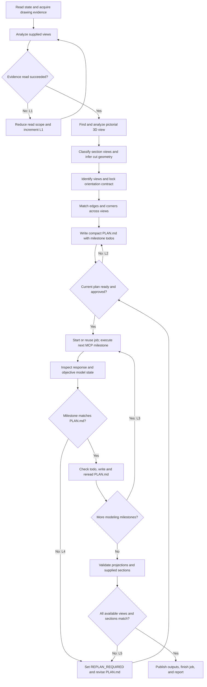

# SolidWorks CAD

Operate SolidWorks only through these nine high-level `mcp__solidworks__` tools.
The runtime tool schemas and returned payloads are the authoritative contract.
Parse each tool's JSON string before acting on its envelope status.

## Tool Boundary

| Tool | Use |
| --- | --- |
| `start_job` | Connect to SolidWorks, optionally open a target document, and return `job_id` plus private `job_token`. |
| `inspect_state` | Read readiness, locked document state, constrained CAD analysis, or approved recipe/schema content. |
| `submit_feature_graph` | Build a new part or assembly from one complete Feature Graph. |
| `apply_document_edits` | Apply allowlisted parametric edits to the locked active document. |
| `drawing_workflow` | Create a production drawing and requested views, annotations, tables, or checks. |
| `save_or_export` | Save, export, batch export, or close through the safety policy. |
| `request_confirmation` | Refresh one-time confirmation data for a pending high-risk action. |
| `confirm_action` | Execute exactly one action after fresh, explicit user approval. |
| `finish_job` | Run final objective verification and close the authenticated job. |

There is no model-visible low-level fallback. Do not use SolidWorks COM, Shell,
macros, scripts, REST endpoints, desktop automation, or legacy low-level CAD MCP
tools. Report `CAPABILITY_GAP` when the nine tools cannot express or inspect the
requested operation. If the nine-tool surface is unavailable, report
`MCP_UNAVAILABLE` and make no CAD call.

## Core Workflow

1. Call `inspect_state(scope="state")` to check readiness and current document.
2. Read only the references needed for the task with
   `inspect_state(scope="reference", reference_topic=...)`.
3. For image or drawing reconstruction, complete the bounded workflow below,
   write `PLAN.md`, and obtain approval before mutation.
4. Call `start_job` before any deep document inspection or mutation. Supply
   `target_document` for an existing file and leave it empty for a fresh model.
5. Keep `job_id` and `job_token` private. Pass both to every later job-scoped
   call. Never place `job_token` in plans, logs, summaries, or user-visible text.
6. Use the smallest matching high-level mutation tool.
7. Inspect every response before continuing. A successful transport call is not
   proof that the CAD result is correct.
8. Save or export only to the requested paths, then call `finish_job`.

`start_job` locks the expected active-document identity. Every later job-scoped
call verifies that identity. If the user switches documents, stop and begin a new
job for the newly intended target.

## Drawing Reconstruction Flow

This flow applies only when geometry is inferred from drawings or images.
At node A, start a job only when deep inspection of an active CAD document is
needed; this is not modeling, and node F reuses that job. Attached images can be
analyzed before any job exists.



The graph has `N=19`, `E=23`, one component, independent loop rank
`E-N+1=5`, and McCabe path complexity `E-N+2=6`. Retry-control locations must
equal the loop rank: exactly these five rows.

| ID | Controlled back edge | Maximum traversal count |
| --- | --- | --- |
| L1 | reduced evidence read -> view analysis | 1 |
| L2 | plan not ready/approved -> PLAN revision | 3 |
| L3 | more milestones -> next milestone | `max(N-1,0)` for `N` modeling todos in the approved plan |
| L4 | milestone mismatch -> replan | 2 per stable modeling todo |
| L5 | directional/sectional mismatch -> replan | 3 per target |

Before a back edge: stop if its count is at maximum; otherwise increment, persist,
then traverse. Counts survive tool changes, hypotheses, and plan versions; reset
only for a changed target or explicit user reset. Keep `L3` by approved
`PLAN_VERSION`, `L4` by todo ID, and copy pre-PLAN `L1` into PLAN.

`L2` includes `BLOCKED` resolution, incomplete plans, user-requested revision, and
withheld approval. Waiting for input does not increment it; a new PLAN revision
does. Do not add another automatic retry path. Confirmation pauses are not retries.
If a flow edit adds or removes a back edge, recompute the graph and table.

At exhaustion, stop mutation:

```text
STATUS: RETRY_EXHAUSTED
LOOP_ID: <L1-L5>
ATTEMPTS: <count/max>
LAST_CAUSE: <failure or mismatch>
ACTION: Stop mutation and request decisive user input.
```

## Inspection

Use `inspect_state` with no credentials only for `state` or `reference`.
Document analysis requires the active job credentials.

| Document | Supported scopes |
| --- | --- |
| Part | `features`, `geometry`, `mass_properties`, `bodies`, `faces`, `edges`, `selection` |
| Assembly | `components`, `components_flat`, `mates`, `faces`, `edges`, `selection` |
| Drawing | `drawing`, `selection` |

Assembly `faces` and `edges` also require `component`. Use identifiers returned
by current inspection data. Reinspect after structural edits because prior
face/edge indexes may no longer identify the same geometry.

Reference topics are `contract`, `canonicalization`, `forward`, `mapping`,
`mapping_part`, `mapping_sheet_metal`, `mapping_assembly`, `verification`,
`reverse`, `coverage`, and `feature_graph_schema`.

If an evidence read is too broad, never repeat it unchanged. Traverse `L1` once
using a smaller image/PDF region or a narrower supported `inspect_state` scope;
do not invent unsupported flags. On another failure emit `RETRY_EXHAUSTED`.

## Feature Graph

For a new part or assembly:

1. Read `forward`, the relevant mapping topic, `verification`, and
   `feature_graph_schema`.
2. Build one complete graph in feature-tree dependency order.
3. Use meters for all Feature Graph distances and radians for all Feature Graph
   angles.
4. Call `submit_feature_graph(..., fresh_document=true)`.
5. Check compiler node results, rebuilt CAD state, topology, dimensions, bounds,
   and physical properties available in `partial_state` and `verification`.

Do not split a complete graph into low-level modeling calls. Do not invent graph
fields, feature types, selectors, units, or references absent from the schema.

## Existing Document Edits

`apply_document_edits` accepts only an array of `{tool, params}` objects using
this allowlist: `modify_dimension`, `edit_feature`, `set_part_material`,
`add_edge_feature`, `create_pattern`, `add_reference_geometry`,
`add_sketch_constraint`, `insert_toolbox_component`, and
`create_exploded_view`. Use current feature names and inspected geometry
references; reinspect after topology changes. Read the relevant reference before
unfamiliar parameters. Deletion and large batches enter confirmation.

## Drawing Workflow

Use `drawing_workflow` for production drawings: model/display views, flat
patterns, section/detail views, model annotations, dimensions, center marks,
BOM/balloons, hole tables, and standards checks. Save the source model first when
views need a stable path. Verify the drawing identity, view count, references,
dimensions, scale, tables, and standards findings returned by the tool.

## Confirmation

For `status="pending_confirmation"`, stop mutation and call
`request_confirmation` with the same job and action IDs. Show its exact
`action_summary`; wait for a new message explicitly approving it; then call
`confirm_action` with the returned action ID/token, exact `confirmation_text` as
`user_confirmation`, and exact summary.

Do not infer approval from the original request. Do not reuse an old or consumed
confirmation token. If risk or summary changes, present the new summary and wait
for another explicit user message. Never automatically re-enter confirmation.

## Transactions And Failures

Feature Graph execution, document edits, and drawing workflows run inside the
SolidWorks undo transaction layer. Existing files also receive a first-write
backup when possible.

Handle response status as follows:

| Status | Action |
| --- | --- |
| `completed` | Continue only after checking `verification`, `partial_state`, and `completed_steps`. |
| `pending_confirmation` | Enter the confirmation workflow and pause. |
| `failed` | Stop; inspect `error` and `recovery_status`. |
| `partial` | Stop; some state may remain. Report `completed_steps`, `partial_state`, backup, and recovery result. |
| `verification_failed` | Stop; execution occurred but objective verification did not pass. |

Treat `recovery_status="rolled_back"` as a failed operation restored by undo.
Treat `rollback_failed` as a potentially modified document requiring immediate
human review. A backup is recovery evidence, not proof that the active document
was restored.

## Verification And Trust

Before completion, verify every applicable exposed item: document identity/type,
rebuild and feature order, topology, dimensions, directions, bounding box,
body/component/mate counts, relevant mass properties, drawing content/standards,
and nonempty requested outputs.

Use the returned trust level accurately:

- `verified`: objective final verification passed.
- `drawing_consistent`: drawing-direction evidence agrees without a reference
  solid comparison.
- `built_unverified`: construction succeeded but required objective evidence was
  unavailable.
- `unverified`: do not claim completion as verified.

`finish_job` is mandatory for a completed write workflow.

## Drawing Reconstruction

For a model reconstructed from images, PDF pages, orthographic views, or sections:

### Pictorial Evidence

Before PLAN, scan every supplied sheet or image region for an isometric,
axonometric, oblique, or perspective view. Record `PICTORIAL_STATUS` as
`found` or `not_found`; when found, record its region, visible faces, handedness,
features, and occlusions.

Use the pictorial view as the highest-confidence source for topology, feature
presence, spatial arrangement, handedness, and front/rear placement. On a
topological or spatial conflict, it wins and the conflict must be logged in PLAN.
Explicit dimensions and section/depth symbols still govern numeric values because
pictorial pixels are not true-size. Reinspect the pictorial view whenever PLAN
reasoning encounters an ambiguity or unmatched detail. If none exists, reconstruct
from orthographic and sectional evidence alone.

### Section Evidence

Before PLAN, detect and classify every supplied section as `full`, `half`,
`offset/stepped`, `aligned`, `broken-out/local`, `revolved`, `removed`, or
`unknown`. Record its parent view, arrow sightline, cut-plane normal and position,
offsets/jogs, local frame, scale, and confidence. Assign `S##` IDs to cut contours
and internal transitions, then map their coordinates into the canonical 3D frame.

Interpret section conventions before inferring solids:

- Hatching means cut material; hatch strokes are not model edges.
- An enclosed unhatched region is only a candidate void when its boundaries,
  centers, or matching evidence support it.
- Cutting-plane jogs are not geometry; combine offset-section segments into one
  section without modeling the jog edges.
- Centerlines are axes or datums. Omitted hidden lines do not prove absence.
- Longitudinally cut ribs, webs, spokes, shafts, and fasteners may remain
  unhatched. In assemblies, a hatch change may separate parts rather than create
  a step in one part.

Treat a section as a projection plus plane and material/void constraints. A
section is strongest for geometry on its cut plane and for otherwise hidden
interiors. Recover missing section lines by testing candidate solids against other
views, centers, tangencies, levels, extents, continuity, containment, feature
connectivity, evidenced symmetry, and through/blind depth evidence. Prefer the
simplest candidate explaining all evidence. Mark each section-derived detail
`resolved`, `assumed`, or `unresolved`; section-only inference is `assumed` and
must be validated.

The pictorial view remains highest-confidence for visible topology and spatial
placement. On a direct pictorial/section conflict, follow the pictorial view and
log the conflict; explicit dimensions and cut/depth symbols govern numeric
placement.

### Orientation Contract

Lock one canonical model frame before interpreting geometry:

```text
+X = model right
+Y = model up
+Z = model front
```

| View | Observer/sightline | Drawing right | Drawing up | Into drawing |
| --- | --- | --- | --- | --- |
| Front | at `+Z`, looking `-Z` | `+X` right | `+Y` up | `-Z` rear |
| Top | at `+Y`, looking `-Y` | `+X` right | `-Z` rear | `-Y` down |
| Left | at `-X`, looking `+X` | `+Z` front | `+Y` up | `+X` right |
| Right | at `+X`, looking `-X` | `-Z` rear | `+Y` up | `-X` left |

Thus the bottom of Top is model front (`+Z`), and the left of Left is model rear
(`-Z`). Projection convention controls sheet placement, not this direction map.
For an existing model, preserve geometry and record a signed canonical-to-document
`CAD_AXIS_MAP`.

With drawing coordinates `u` right and `v` up:

```text
Front: X=+u, Y=+v
Top:   X=+u, Z=-v
Left:  Z=+u, Y=+v
Right: Z=-u, Y=+v
```

### Edge And Corner Correspondence

Before selecting features, assign `E##` IDs to topology-driving lines/arcs/edges
and `V##` IDs to endpoints, intersections, and corners. Record source position,
line type, visibility, adjacency, candidate feature, and evidence in every view.

| View | Fixed point coordinates | Projected edge components |
| --- | --- | --- |
| Front | `X,Y`; `Z` unresolved | `(dX,dY)` |
| Top | `X,Z`; `Y` unresolved | `(dX,-dZ)` |
| Left | `Z,Y`; `X` unresolved | `(dZ,dY)` |
| Right | `Z,Y`; `X` unresolved | `(-dZ,dY)` |

Match details by signed coordinates, aligned endpoints, adjacency, closed loops,
symmetry, centers, and visible/hidden transitions. Infer each 3D edge from at
least two independent projections; use the third as confirmation or explain why
it becomes a point, coincident contour, hidden edge, or occluded detail.

A section is one projection plus cut-plane and material/void constraints. It can
resolve an internal edge when paired with another hidden line, centerline,
dimension, repeated section, or supported continuity inference. Record the
matching `S##` evidence; unsupported section-only placement remains `assumed` and
must be validated.

For example, a line in the middle of Left supplies `Z,Y`; locate the same `Y` in
Front and `Z` in Top to resolve its `X` location or extent. Mark every detected
nonconstruction detail `resolved` or `explained`. Cross-check Front/Top width,
Front/Side height, Top/Side depth, and every hole, cut, step, and protrusion.
Derive a missing view from this same correspondence, not from a separate guess.

### PLAN.md

Before the first mutation, create one workspace `PLAN.md` and reuse it as this
task's long-term memory. Keep it under 70 lines and 4 KB.

```markdown
# CAD Reconstruction Plan
PLAN_VERSION: 1
PLAN_STATUS: DRAFT
LOOP_COUNTS: L1=0; L2=0; L3={}; L4={}; L5=0
TARGET: <source and requested output>
MODE: <exact|schematic>
PROJECTION: <first-angle|third-angle>
NORMALIZATION: <dimensions or schematic scale>
MODEL_FRAME: +X=right; +Y=up; +Z=front
CAD_AXIS_MAP: <canonical -> document signed axes>
SIDE_VIEW: <left|right>
VIEW_DATUMS: <shared X/Y/Z datums>
PICTORIAL: <status; source; findings; conflicts>
SECTIONS: <not_present or IDs; type; parent; sightline; plane/offsets; confidence>
DETAIL_COVERAGE: <detected/resolved/explained/unresolved>
## View Ledger
| View | Envelope | Features | Hidden/depth evidence |
| --- | --- | --- | --- |
| Front | ... | ... | ... |
| Top | ... | ... | ... |
| Side | ... | ... | ... |
| Section(s) | ... | ... | cut material/void; missing-line inference |
## Detail Correspondence
| ID | Front | Top | Side/Section | 3D inference/status |
| --- | --- | --- | --- | --- |
| E01/V01 | ... | ... | ... | ... |
## Feature Sequence And Todo
- [x] Analyze pictorial, orthographic, and sectional evidence
- [x] Lock orientation, side view, missing view, and detail IDs
- [ ] Approve this PLAN_VERSION
- [ ] M1 <evidence IDs; plane; signed direction; end condition>
- [ ] M2 <...>
- [ ] Validate Front
- [ ] Validate Top
- [ ] Validate Side
- [ ] Validate supplied Sections
- [ ] Save/export requested outputs
## Validation Matrix
| View | Planned checks | Result |
| --- | --- | --- |
| Front | ... | pending |
| Top | ... | pending |
| Side | ... | pending |
| Section(s) | cut contours; material/void; transitions; depth | pending or N/A |
LAST_CHECKPOINT: none
REPLAN_LOG: none
```

Use `exact` mode for dimensioned/fabrication work. Use `schematic` for
dimensionless projection exercises; preserve available proportions or record one
normalization, and state depth/handedness assumptions.

Set `PLAN_STATUS: READY` only when all view roles, axis signs, topology,
handedness, missing views, section planes/conventions, dimensions/normalization,
detail IDs, feature order, directions, end conditions, and measurable validation
checks are coherent. Every detail must be resolved/explained by cross-view
evidence, section constraints, or a documented projection/occlusion explanation.

If one decision can change topology or handedness, set `BLOCKED` and ask one
focused question. Waiting does not consume `L2`; revising PLAN after new input
does. Present the compact plan and obtain explicit approval of its current version.
Only then set `APPROVED` and check its approval todo. Any changed topology,
orientation, dimension, direction, or feature order creates a new version.

### Execute, Checkpoint, And Validate

Read approved PLAN in full immediately before mutation. Start or reuse the job,
read only the required Feature Graph references, then prefer one complete
`submit_feature_graph(..., fresh_document=true)` for a new model. Do not split a
complete graph merely to create checkpoints.

One successful complete graph is one MCP milestone and may check every modeling
todo it covers after objective readback. For genuinely staged edits or drawing
operations, each high-level MCP call is one milestone and `L3` controls
continuation. Before each payload, resolve sketch plane and every extrusion, cut,
hole, mirror, pattern, and offset direction through the Orientation Contract and
`CAD_AXIS_MAP`.

After each milestone, use `inspect_state` with the smallest relevant scopes.
Compare feature results, bounds, topology, dimensions, directions, and evidence
IDs with PLAN. On match, check only covered todos, update `LAST_CHECKPOINT` and
loop counts, write PLAN, and immediately reread it. On mismatch, stop mutation,
use `L4`, set `REPLAN_REQUIRED`, log the smallest mismatch and root cause, revise
PLAN/version, and obtain approval before repair.

Validate independently:

- Front looking `-Z`: width, height, silhouette, levels, openings, and centers.
- Top looking `-Y`: drawing bottom is `+Z` front; check footprint, depth, offsets,
  openings, and front/rear placement.
- Left looking `+X`: drawing left is `-Z` rear; check transitions, thicknesses,
  cuts/holes, and front/rear placement.
- Right looking `-X`: drawing right is `-Z` rear; use this instead for a Right view.
- Each supplied section: recreate its cut plane and sightline; check cut contours,
  material/void regions, centers, transitions, connectivity, and through/blind
  depths. Missing hidden lines alone are neither PASS nor FAIL.

Write `PASS`, `FAIL`, or `UNAVAILABLE` with evidence in each Validation Matrix
row. When useful and planned, make a working save and use `drawing_workflow` to
create Front/Top/Side validation views. View creation alone is not a PASS; the
returned evidence must support comparison.

On any directional or sectional `FAIL`, stop final save/export, traverse `L5`,
reinspect the pictorial view first when one was found, update PLAN before repair,
and obtain approval again. If a direction or section is `UNAVAILABLE`, do not loop
or invent a pass; finish only if MCP final verification can complete, then report
`built_unverified` and name the gap.

Without a reference solid, use `drawing_consistent` only when Front, Top, and Side
and every supplied section all pass. Mark PLAN `COMPLETE` only after required
outputs and `finish_job` succeed.

## Final Report

Report:

- document and requested outputs
- operations actually completed
- objective verification performed
- final `status`, `verification_status`, `recovery_status`, and `trust_level`
- assumptions, unavailable checks, or capability gaps

Never claim success from appearance or a tool return code alone.
